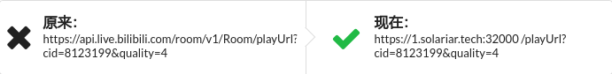

# getPlayUrl - Bilibili Live API Hacker

getPlayUrl 是一个用来打破 Bilibili Live API 封锁的工具。

因为 Bilibili Live 的 playUrl API 把国内大部分主机商的服务器ban了，所以就有了这个工具。

## 原理

分为后端和前端。  
后端维护一个 WebSocket 服务和 playUrl API，前端将会与后端的 WebSocket 服务连接。  
当有用户调用 playUrl API 时，后端服务器将会在所有连接的前端页面里随机选择一个，并将请求发送至该页面。  
接下来，该页面将会调用 Bilibili Live 的 playUrl API，并将结果通过 WebSocket 返回至服务器。  
最后，服务器将结果返回给提出请求的用户。

## 使用方法

您只需要将原先您的程序中对 Bilibili Live API 的调用的 URL 地址改为 getPlayUrl 服务地址即可。

您可以自行部署后端，或者使用我们的公共服务：

## Contribute

Issues and PRs are welcomed.
